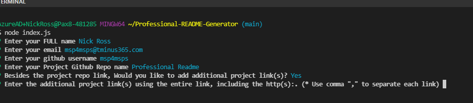
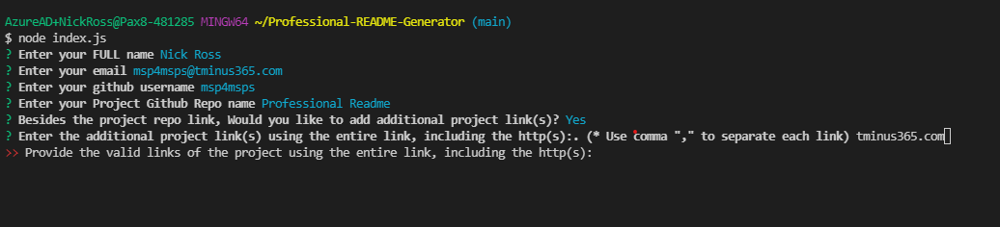
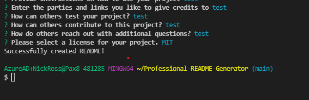

 
# PROFESSIONAL README GENERATOR
[](https://github.com/msp4msps)
[](https://github.com/msp4msps/Professional-README-Generator)
[](https://github.com/msp4msps/Professional-README-Generator)
[](https://choosealicense.com/licenses/mit/)
## Table of Content
* [ Project Links ](#Project-Links)
* [ Screenshots](#Screenshots)
* [ Project Description ](#Project-Description)
* [ User Story ](#User-Story)
* [ Technologies ](#Technologies)
* [ Installation ](#Installation)
* [ Usage ](#Usage)
* [ Credits and Reference ](#Credits-and-Reference)
* [ Tests ](#Tests)
* [ Contributing ](#Contributing)
* [ Questions ](#Questions)
* [ License ](#License)
#
##  Project Links
https://github.com/msp4msps/Professional-README-Generator<br>

## Screenshots-Demo
<kbd></kbd><kbd></kbd><kbd></kbd><kbd></kbd>

## Project Description
This project allows you to generate a professional README based on inputs from questions you are prompted with in the commandline. This ensures consistency in your README files as well as the adherence to best practices.

## User Story
As a user, I would like a professional readme to be generated based on inputs that I enter
## Technologies 
```
Javascript, Node.js
```

## Installation
Clone Repo locally
## Usage 
Run node index.js in terminal

## Credits and Reference
None
## Tests
npm test
## Contributing
Open a pull request
## Questions
Contact info below Contact the author with any questions!
Contact the author with any questions!<br>
Github link: [msp4msps](https://github.com/msp4msps)<br>
Email: msp4msps@tminus365.com
## License
This project is [MIT](https://choosealicense.com/licenses/mit/) licensed.<br />
Copyright © 2021 [NICK ROSS](https://github.com/msp4msps)

